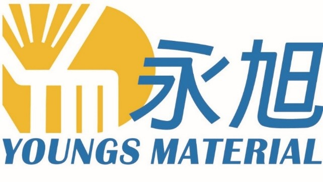

<!DOCTYPE html>
<html lang="zh-Hant">
<head>
  <meta charset="UTF-8">
  <title>聯絡我們｜永旭材料貿易有限公司</title>
  <meta name="viewport" content="width=device-width, initial-scale=1.0">

  <link rel="stylesheet" href="https://unpkg.com/@picocss/pico@latest/css/pico.min.css">
</head>
<body>

<!-- ===== Header / Banner（不動） ===== -->

  

    

    <nav style="display:flex; gap:1.5rem; font-size:0.95rem; align-items:center;">
      <a href="index">公司簡介</a>
      <a href="brands">代理品牌</a>
      <a href="products">產品列表</a>
      <a href="faq">FAQ</a>
      <a href="contact" style="font-weight:600;">聯絡我們</a>
    </nav>
  

<!-- ===== Main Content ===== -->
<section style="max-width:1200px; margin:3rem auto; padding:0 1rem;">
  

    <!-- 左欄：聯絡資訊 -->
    

      <h2>聯絡資訊</h2>
      
如需產品規格、技術資料或報價，歡迎與我們聯繫。

      
<strong>公司名稱：</strong> 永旭材料貿易有限公司

      
<strong>地址：</strong> 臺南市北區大和路330巷21號1樓

      
<strong>Email：</strong> ray@youngs.com.tw

      
<strong>TEL：</strong> 06-2580502

      
<strong>FAX：</strong> 06-2116934

      
<strong>服務時間：</strong> 週一至週五 08:30–17:30

    

    <!-- 右欄：聯絡表單 -->
    

      <h2 style="margin-top:0;">聯絡表單</h2>
      

        請填寫以下資料，我們將儘快與您聯繫。
      

      <form
        action="https://formsubmit.co/ray@youngs.com.tw"
        method="POST"
        style="display:grid; gap:0.6rem; font-size:0.9rem;"
      >
        <!-- FormSubmit 設定 -->
        <input type="hidden" name="_subject" value="官網聯絡表單詢問">
        <input type="hidden" name="_captcha" value="false">
        <input type="hidden" name="_template" value="table">

        <label>
          公司名稱
          <input type="text" name="company" placeholder="請輸入公司名稱">
        </label>

        

          <label>
            聯絡人
            <input type="text" name="contact_name" placeholder="請輸入姓名">
          </label>

          <label>
            性別
            <select name="gender">
              <option value="">請選擇</option>
              <option>先生</option>
              <option>女士</option>
              <option>其他</option>
            </select>
          </label>
        

        <label>
          聯絡電話
          <input type="tel" name="phone" placeholder="例如：06-2580502">
        </label>

        <label>
          電子郵件
          <input type="email" name="email" required placeholder="example@email.com">
        </label>

        <label>
          詢問內容
          <textarea name="message" rows="3" placeholder="請輸入您的需求或產品規格"></textarea>
        </label>

        <button type="submit" style="
          margin-top:0.8rem;
          background:rgba(47,58,65,0.5);
          border:none;
          padding:0.6rem 1.2rem;
          font-size:0.9rem;
          width:140px;
          color:#fff;
          border-radius:4px;
          cursor:pointer;
        "
        onmouseover="this.style.background='rgba(47,58,65,0.8)'"
        onmouseout="this.style.background='rgba(47,58,65,0.5)'"
        >
          送出表單
        </button>
      </form>
    

  

</section>

<!-- ===== Footer（不動） ===== -->
<footer style="
  margin-top:4rem;
  padding:1.5rem 1rem;
  border-top:1px solid #e5e5e5;
  font-size:0.85rem;
  color:#555;
">
  

    
永旭材料貿易有限公司 ©

    
YOUNGS MATERIAL CO., LTD.

    
電話：06-2580502 ｜ 地址：臺南市北區大和路330巷21號1樓

  

</footer>

</body>
</html>
