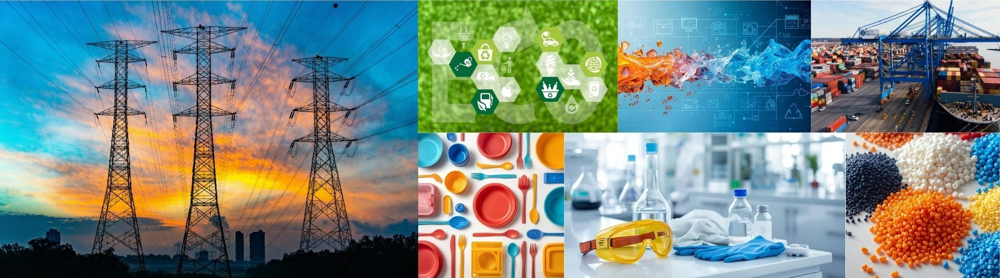

 <title>永旭材料貿易有限公司 YOUNGS</title>

<meta name="google-site-verification" content="QJDnL7dGoZky77bYhCPzByI4d13W8HrakQL2bUWxmMQ" />

<link rel="stylesheet" href="https://unpkg.com/@picocss/pico@latest/css/pico.min.css">

  

    <!-- 左側 LOGO -->
    

    <!-- 右側 導覽列 -->
    <nav style="
      display:flex;
      gap:1.5rem;
      font-size:0.95rem;
      align-items:center;
      white-space:nowrap;
    ">
      <a href="index">公司簡介</a>
      <a href="brands">代理品牌</a>
      <a href="products">產品列表</a>
      <a href="faq">FAQ</a>
      <a href="contact" style="font-weight:600;">聯絡我們</a>
    </nav>

  

 

# 公司簡介

 

**永旭材料貿易有限公司(Youngs Material Co., Ltd.)成立於2019年，從事化學原物料的代理經銷及現貨供應。**   
主要代理萬華化學集團股份有限公司(Wanhua Chemical Group Co., Ltd.)產品，提供優質的服務及合理價格，在技術上的支援及產業資訊分析與分享，使客戶能及時掌握最新的市場脈動，與供應商及客戶一同開發，提供客戶最佳的解決方案，共創營業利潤。我們銷售多種類的產品，如泛用工程塑膠、透明工程塑膠、高性能工程塑膠、熱可塑形彈性體、RO膜等，服務對象涵蓋電子、光學、運動休閒器材、製造、電線電纜、異型壓出管件、汽車等相關應用領域。

 

### 環境責任與未來方向
永旭關注材料在產品生命週期中的角色，並持續引進具備環保價值的材料選項，以回應市場對永續發展的需求。
目前本公司所提供之 PCR（Post-Consumer Recycled）回收再製材料，其原料來源來自**具備 GRS 認證之上游製造商**。作為材料貿易商，永旭材料重視供應鏈資訊的正確揭露，並清楚區分產品來源認證與公司營運認證。未來將視業務發展及市場需求，評估申請相關永續認證之可行性，持續強化環保材料供應及資訊透明度。

  

---

📩 **需要完整規格、應用建議或報價？**  
👉 [請聯絡我們](contact)

<footer style="
  margin-top:4rem;
  padding:1.5rem 1rem;
  border-top:1px solid #e5e5e5;
  font-size:0.85rem;
  color:#555;
">
  

    
永旭材料貿易有限公司 ©

    
YOUNGS MATERIAL CO., LTD.

    
電話：06-2580502 ｜ 地址：臺南市北區大和路330巷21號1樓

  

</footer>
