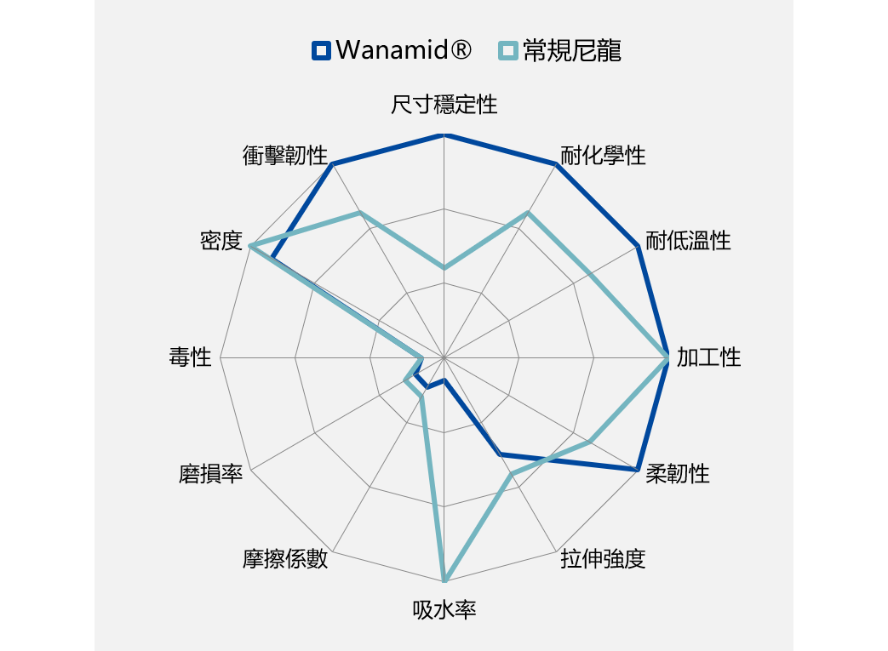

<link rel="stylesheet" href="https://unpkg.com/@picocss/pico@latest/css/pico.min.css">

  

    <!-- 左側 LOGO -->
    

    <!-- 右側 導覽列 -->
    <nav style="
      display:flex;
      gap:1.5rem;
      font-size:0.95rem;
      align-items:center;
      white-space:nowrap;
    ">
      <a href="index">公司簡介</a>
      <a href="brands">代理品牌</a>
      <a href="products">產品列表</a>
      <a href="faq">FAQ</a>
      <a href="contact" style="font-weight:600;">聯絡我們</a>
    </nav>

  

#  PA12 (Polyamide 12、Nylon 12)  
# 聚醯胺、尼龍12

品牌: Wanhua Chemical 萬華化學 Wanamid®

## 產品特性

  <!-- 左邊文字 -->
  

    <ul style="padding-left:20px; line-height:1.6; font-size:16px;">
      <li>耐磨耗</li>
      <li>耐熱</li>
      <li>耐化性</li>
      <li>抗衝擊性</li>
      <li>尺寸穩定性</li>
      <li>出色的耐候性</li>
    </ul>
  

<!-- 右邊圖片 -->

  

## 成形條件：

預乾燥溫度 80℃ ~ 100℃

預乾燥時間 4 ~ 5小時

注塑溫度 210℃ ~ 260℃

模具溫度 30℃ ~ 60℃

## 常見應用
- 機械零件
- 齒輪
- 汽車零部件
- 管材
- 披覆層
- 線材
- 織物

## 產品描述

| 類別 |   規格   | 密度(g/cm³) | 拉伸模量(MPa) | 衝擊強度Charpy (kJ/m²) | 熱變形溫度HDT (℃)  |  備註 |
|--------|---------|--------|----------|------------|------------|--------|
| 柔性 | L2030P   | 1.03 | 370 | 130 | 85 (0.45MPa) | 高黏度 |
| 柔性 | L2040P   | 1.02 | 400 | 130 | 100 (0.45MPa) | 高黏度 |
| 柔性 | L2050P   | 1.01 | 520 | 105 | 105 (0.45MPa) | 高黏度 |
| 柔性 | L2050P Y | 1.01 | 550 | 100 | 110 (0.45MPa) | 高黏度 |
| 一般級 | L1001 |  |  |  |  (0.45MPa) | 低黏度 |
| 一般級 | L2001 | 1.01 | 1350 | 15 | 115 (0.45MPa) | 中黏度 |
| 一般級 | L3001 | 1.01 | 1450 | 13 |  (0.45MPa) | 高黏度 |
| 增強級 | L2150G | 1.11 | 3800 | 18 | 160 (1.8MPa) | 15%GF |
| 增強級 | L2230G | 1.18 | 5500 | 23 | 160 (1.8MPa) | 23%GF |
| 增強級 | L2300G | 1.23 | 6800 | 25 | 165 (1.8MPa) | 30%GF |
| 增強級 | L2400G | 1.34 | 8500 | 25 | 165 (1.8MPa) | 40%GF |
| 增強級 | L2500G | 1.46 | 13500 | 26 | 165 (1.8MPa) | 50%GF |
| 增強級 | L2650G | 1.64 | 18500 | 20 | 165 (1.8MPa) | 65%GF |
| 增強級 | L2600L | 1.57 | 18000 | 44 | 168 (1.8MPa) | 60%GF 長纖 |
| 增強級 | L2100C | 1.06 | 7000 | 20 | 165 (1.8MPa) | 10%CF |
| 增強級 | L2150C | 1.12 | 8400 | 16 | 170 (1.8MPa) | 15%CF |
| 增強級 | L2200C | 1.12 | 8500 | 31 | 170 (1.8MPa) | 20%CF |
| 增強級 | L2300C | 1.15 | 15000 | 20 | 170 (1.8MPa) | 30%CF |
| 增強級 | L2400C | 1.22 | 23000 | 13 | 170 (1.8MPa) | 40%CF |
| 阻燃級 |  |  |  |  |  | 0.8mm V2 |
| 阻燃增強級 |  |  |  |  |  | 1.6mm V0、5VA |
| 特殊級 |  |  |  |  |  | 超低密度0.82 |
| 特殊級 |  |  |  |  |  | 3D列印PA12粉末 |

## 產品描述

品牌:  恒尼 HiNNY®

| 類別 |   規格   | 密度(g/cm³) | 拉伸模量(MPa) | 衝擊強度Charpy (kJ/m²) | 熱變形溫度HDT (℃)  |  備註 |
|--------|---------|--------|----------|------------|------------|--------|
| 一般級 | TN955 | 1.02 | 1680 | 15 | 120 (0.45MPa) | 透明、47% 生物基、對應Arkema G850  |
| 一般級 | TN926 | 1.02 | 1580 | 18 | 120 (0.45MPa) | 透明、對應EMS TR90 |
| 一般級 | TN956 | 1.00 | 1600 | 20 | 140 (0.45MPa) | 透明 |
| 長碳鏈尼龍 |  |  |  |  |  | PA610、63% 生物基 |
| 長碳鏈尼龍 |  |  |  |  |  | PA612 |
| 長碳鏈尼龍 |  |  |  |  |  | PA1010、100% 生物基 |
| 長碳鏈尼龍 |  |  |  |  |  | PA1012、45% 生物基 |

🔗 延伸材料參考：
- [返回產品總覽](products)

---

📩 **需要完整規格、應用建議或報價？**  
👉 [請聯絡我們](contact)

<footer style="
  margin-top:4rem;
  padding:1.5rem 1rem;
  border-top:1px solid #e5e5e5;
  font-size:0.85rem;
  color:#555;
">
  

    
永旭材料貿易有限公司 ©

    
YOUNGS MATERIAL CO., LTD.

    
電話：06-2580502 ｜ 地址：臺南市北區大和路330巷21號1樓

  

</footer>
