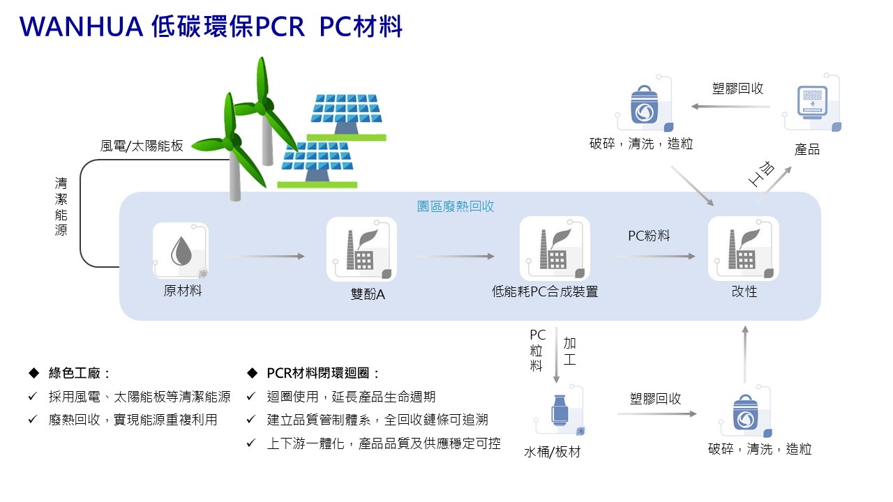

<link rel="stylesheet" href="https://unpkg.com/@picocss/pico@latest/css/pico.min.css">

  

    <!-- 左側 LOGO -->
    

    <!-- 右側 導覽列 -->
    <nav style="
      display:flex;
      gap:1.5rem;
      font-size:0.95rem;
      align-items:center;
      white-space:nowrap;
    ">
      <a href="index">公司簡介</a>
      <a href="brands">代理品牌</a>
      <a href="products">產品列表</a>
      <a href="faq">FAQ</a>
      <a href="contact" style="font-weight:600;">聯絡我們</a>
    </nav>

  

# PCR (Post-Consumer Recycled) 
# 環保回收再製材料

品牌: Wanhua Chemical 萬華化學 Clarnate®、WanBlend®

採用 PCR 再生材料，不僅可有效降低對原生塑料的依賴，減少碳排放與環境負擔，也符合全球對循環經濟與永續發展的趨勢，是兼顧性能與環保責任的理想選擇。

## 產品特性 ：
1. 降低碳排放
2. 促進資源循環
3. 減少環境污染風險
4. 支持回收體系發展
5. 回應消費者永續期待
6. 提升供應鏈責任
7. 符合國際永續趨勢與法規方向
8. 強化 ESG 指標量化基礎
9. 降低未來法規與市場風險

## 常見應用
- 電子產品外殼
- 消費性用品
- 工業零件
- 包裝領域

## PCR PC 產品描述

| 類別 | 規格 | 備註 |
|----|--------|--------|
| PCR PC |R1050| GRS、100% PCR |
| PCR PC |R1100| GRS、100% PCR |
| PCR PC |R1250| GRS、100% PCR |

## PCR PC/ABS 產品描述

| 類別 | 規格 | 備註 |
|------|--------|--------|
| PCR PC/ABS | CA1560 R50 | GRS、50% PCR |
| PCR PC/ABS | CA1580 R75 | GRS、75% PCR |
| PCR PC/ABS | CA3150 CM R75 | GRS、75% PCR、15% Talc |
| PCR PC/ABS | CA3250 R65 | GRS、65% PCR |
| PCR PC/ABS | CA3350 R75 | GRS、75% PCR、1.5mm V0 |
| PCR PC/ABS | FR3730M R50 | GRS、50% PCR、1.5mm V0 阻燃 |

🔗 延伸材料參考：
- [PC 聚碳酸酯](pc)
- [PC合金、PC/ABS 合金](pc-abs)
- [返回產品總覽](products)

---

📩 **需要完整規格、應用建議或報價？**  
👉 [請聯絡我們](contact)

<footer style="
  margin-top:4rem;
  padding:1.5rem 1rem;
  border-top:1px solid #e5e5e5;
  font-size:0.85rem;
  color:#555;
">
  

    
永旭材料貿易有限公司 ©

    
YOUNGS MATERIAL CO., LTD.

    
電話：06-2580502 ｜ 地址：臺南市北區大和路330巷21號1樓

  

</footer>
